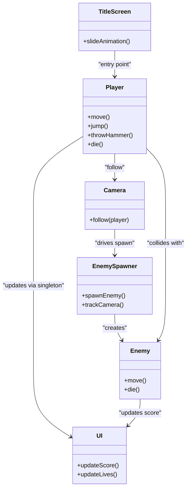

# Engine Lab Assignment 1
## Adventure Island <1h recreation

You move around with the arrow keys to avoid enemies, jump with space, and throw a hammer using the "z" key.

## Diagram

## Answers

* Live tracking and score tracking use the **Singleton design pattern**.
* Depending on the setup of user interfaces or other interaction systems, it can be useful. In my case, I made use of it for GUI updates to prevent reference tracking to update labels.

---

*Kenechukwu Ozoemene - 100841149*

Assets used are modified variants of files found at: https://www.spriters-resource.com/nes/advisle/
